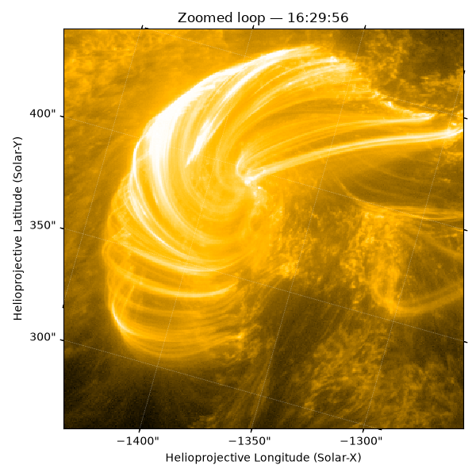

# Solar Physics Capstone Project

This website documents my progress throughout my capstone project, including my weekly work, data analysis, things I've learned/find interesting, etc.

This project seeks to measure and analyse the fine-scale features of the flare loops observed on the 20th of August 2026 solar flare by Solar Orbiter/EUI, in particular their widths, and to investigate instrument limitations on the resolution.

## Weekly Updates

- [Week 1](week01.md)
- [Week 2](week02.md)
- [Week 3](week03.md)

