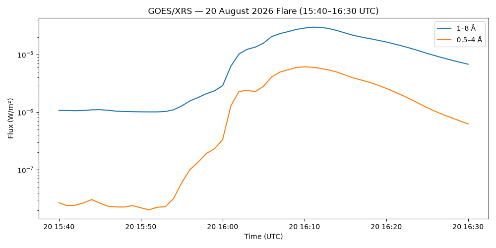
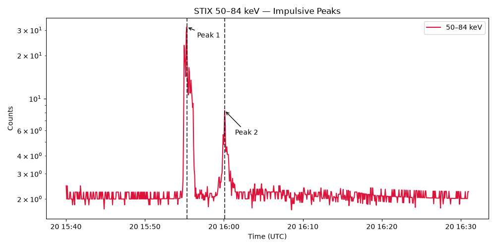
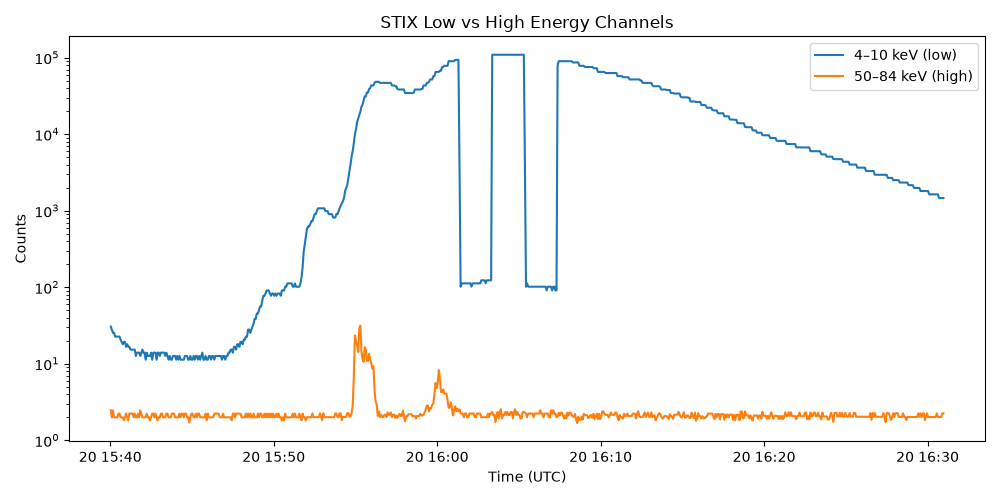
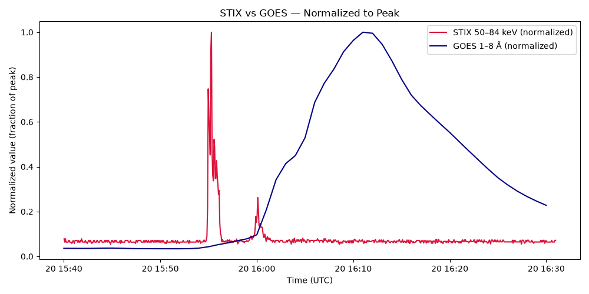

# Week 1

## What I did

- Install SunPy and complete the tutorial, taking notes of any information/commands I thought I would find useful throughout the project. Paid special attention to the sections on maps and timeseries. 

- Created a google document that I am using as a lab notebook. I use it to keep track of everything I do, write down what I learn so that I dont forget, and leave notes to myself so I know where to pick up from.

- Created a GitHub accound and got familiar with how to use it. I connected it to the virtual environment that I have been working on and started learning some commands and writing them down on my notebook. The main thing I learned is that there are three "states": the working directory, the staging area, and the repository. I have been pushing the code that I have been completing to my repository. 

- Attended my first group meeting. All I did was introduce myself and quickly talk through the work I'll be doing and what I understand of it as of now. For future meetings, I need to prepare slides where I update the group on 1. what I have been up to, 2. what I’m planning to do next, and 3. highlights. This should not exceed 5 minutes and should show at least one plot. 

- Completed the first SunPy exercises. Loaded the EUI fits file and extracted useful metadata as well as plotted the image of the solar loop I will be looking at in the project. I included my observations in a markdown cell in 'sunpy_basics.ipynp' as well as the image.

- Used GOES data to make an X-ray plot of the flare, as well as leaning about the GOES channels and flare classes. 

- Installed Stixpy and read about what STIX is, what it measures, its energy channels and how its different from GOES x-ray measurements. Made three plots: 1. the main impulse peaks, 2. lower-energy vs. higher-energy channels, and 3. compare STIX vs. GOES emission plots.

## Things that worked

I understand all the things I've been reading up on and now know how to open the files, look at the metadata and I am learning how to analyse it and what to look for when it comes to solar flares.

## Things I found difficult

Some concepts were hard to wrap my head around, like how GitHub works and the differences between GOES and STIX. Because I found these things difficult, I took my time when learning about them and wrote a lot of notes throughout this process.

## What I learned about working with the different data

I learned that in order to get the "full" picture on the flares I need to use multiple resources, instruments and data, and that in order to conduct a good analysis I need to be able to piece together different observations.

## Questions I still have

I want to know why there are two peaks in the STIX time profile and I want to fully understand why the GOES and STIX peaks are different. 

## Plan for next week

I need to finish the "First EUI flare sequence" section and start working on the Week 2 exercises. I also need to prepare slides for the group meeting.
