I started the week off by installing Stixpy and understanding STIX. STIX is another instrument on Solar Orbiter, alongside EUI. While EUI takes images of the Sun in extreme UV light, STIX specifically detects X-rays coming from flares. These are produced by very high-energy electrons that get accelerated during the flare and slam into the denser lower solar atmosphere, emitting X-rays as they decelerate. So while GOES also measures X-rays, STIX does it from the Solar Orbiter’s vantage point, closer to the Sun and at a different viewing angle than Earth. 

STIX doesn’t just measure “total X-rays”, it separates detected X-rays into different energy bins e.g., 4–10 keV, 10–15 keV, 25–50 keV, etc. Each channel tells you how many X-ray photons arrived within that specific energy range during each time interval. This is conceptually similar to how GOES has two channels (1–8 Å and 0.5–4 Å) , except STIX has many more, finer channels, giving a more detailed energy breakdown.

Flares happen in stages. An initial fast, violent “impulsive phase” (where electrons get suddenly accelerated to huge speeds after reconnection), followed by a longer, gentler “decay phase” or “gradual phase” as things cool down. The highest energy X-rays are produced by the fastest, most energetic electrons, and those are only present right at the peak of the impulsive phase, when the flare's magnetic energy is being released most violently. So if you look at a high-energy channel versus a low-energy channel , the high-energy channel will show a sharp, brief spike concentrated right at the flare’s most explosive moment, while lower-energy channels tend to show a broader, longer-lasting signal from the heating and cooling of the surrounding plasma.

STIX timing might differ from GOES due to different reasons. Firstly, flares produce a cascade of physical processes at different energies, and each instrument/channel only “sees” the range it's sensitive to. STIX’s highest-energy channels detect the initial burst of very fast, non-thermal electrons: a short, sharp spike that fades quickly once that one-time burst of acceleration ends. Those electrons also heat surrounding plasma, which then glows steadily in lower-energy, thermal X-rays as it cools. This is the gradual “climb and decay” that GOES 1-8 A channel (and STIX lower channels) are built to catch. So GOES isn’t blind to the impulsive phase, its flux starts rising at around the same time as STIX’s spike, but it keeps climbing well after STIX’s burst has faded, because it’s tracking the slower-cooling aftermath rather than the brief spark itself. No single instrument sees the whole picture, STIX captures the spark, GOES (and STIX-low) capture the glow that follows.

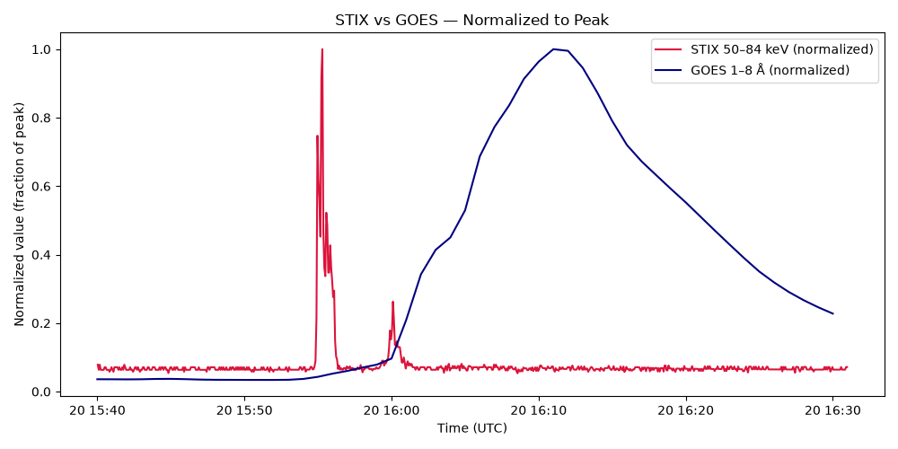

I downloaded the EUI flare sequence data and created several images of the loop within the 15:49 - 16:30 time window. It is important to remember that even though the loop isn’t visible in the first few images, there is still a loop. It is just not visible in EUI. 

| 15:49:56 | 15:55:56 | 15:59:56 | 16:04:56 |
|:---:|:---:|:---:|:---:|
| 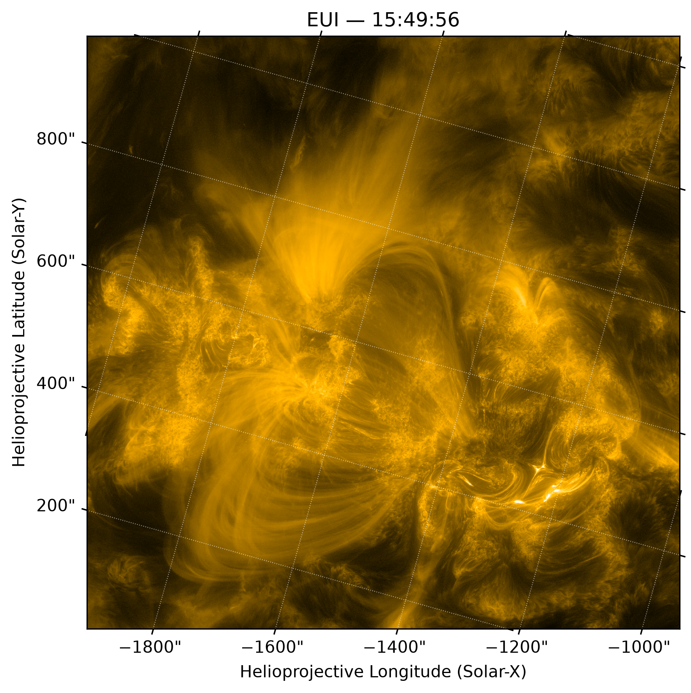 | 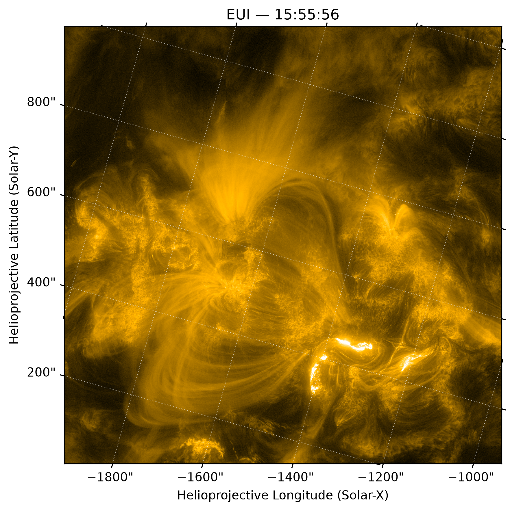 | 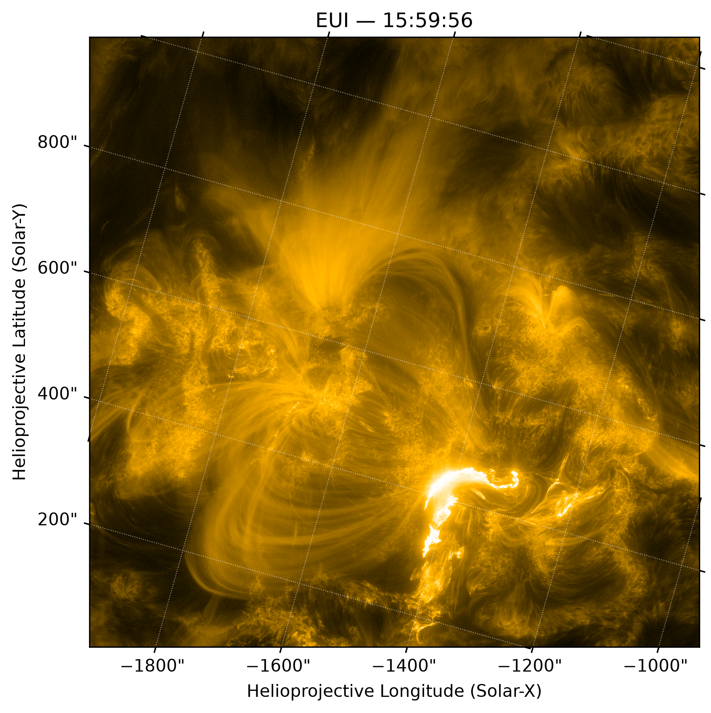 | 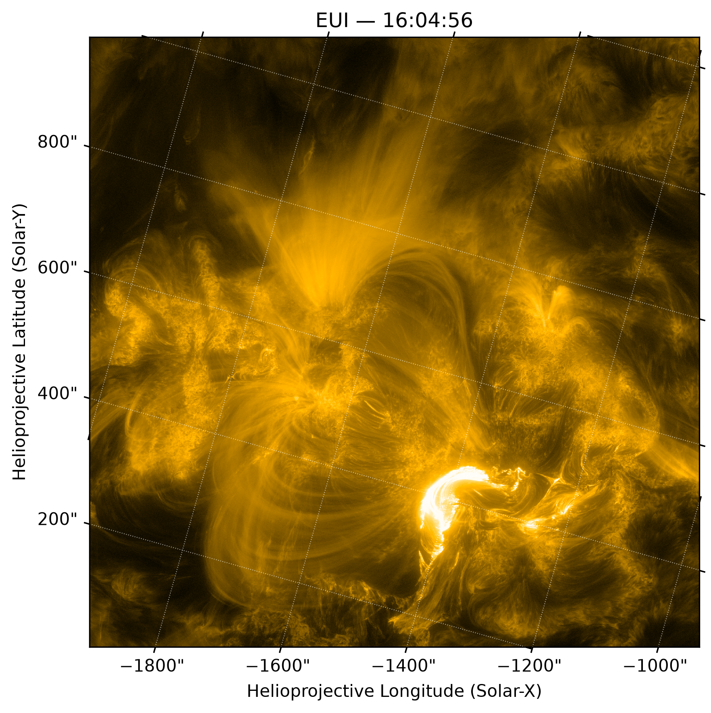 |

| 16:14:56 | 16:19:56 | 16:24:56 | 16:29:56 |
|:---:|:---:|:---:|:---:|
| 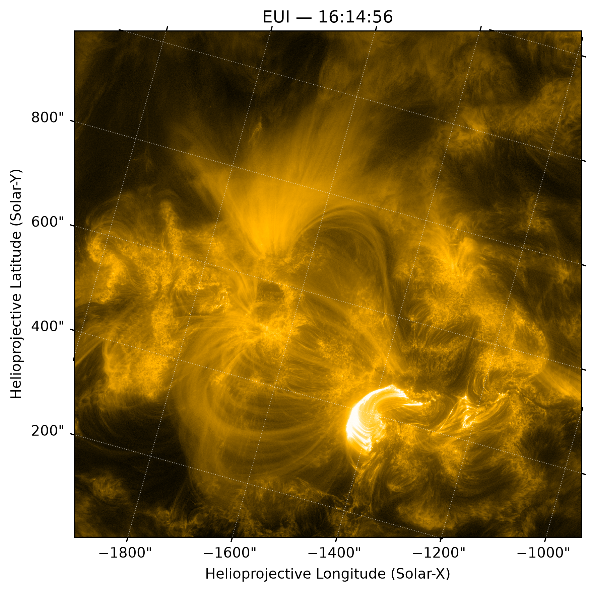 |  | 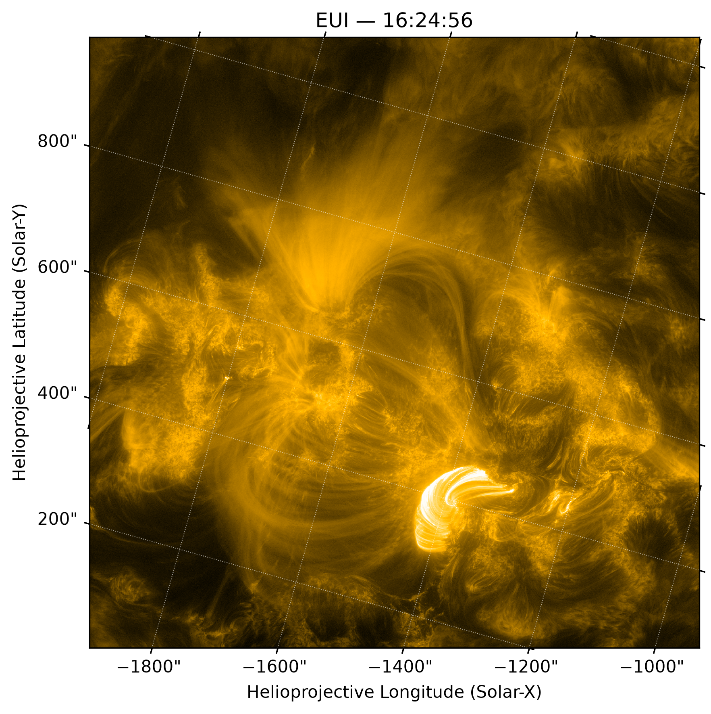 | 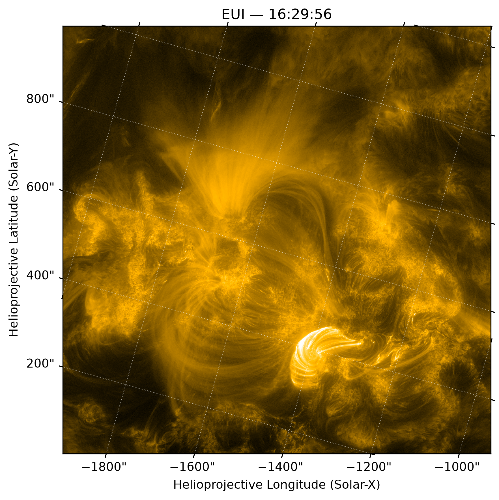 |

I also played around with different percentile images as well as a logstretch image, and I plan to bring these into my slicing this week to see what works best for width measurements. 

I obtained the intensity profile for a regular exposure and short exposure image: 

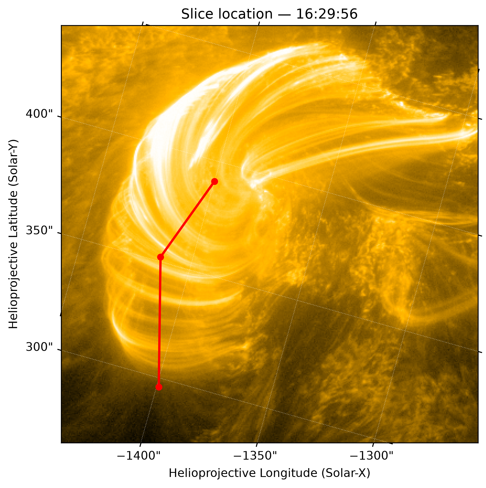

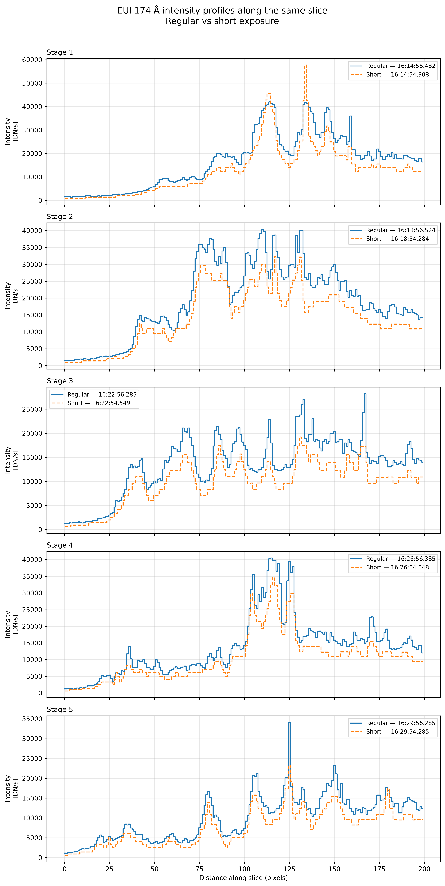

I also summed the pixel values from 15:45 to 16:30 and plotted the sum against time to see the profile.

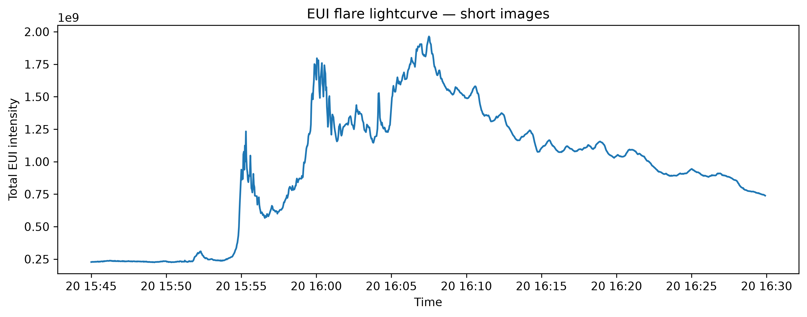

The plot clearly shows the impulsive and gradual phases in agreement with the STIX vs. GOES plot.

Lastly, I wrote code (with the help of AI) that automates the slicing process. It generates an interactive image (regular exposure) that lets the user pick points to set the slicing path and obtains the closest short exposure image. It then plots the intensity profiles for both regular and short exposure versions, as well as the peaks over the image. 

On week 3, I will start by picking settings that best display the peaks in the intensity profiles and start to properly measure loop widths, fitting Gaussian profiles and calculating the FWHM values in pixels -> km. What I did in week 2 was the preparation for this next step. 