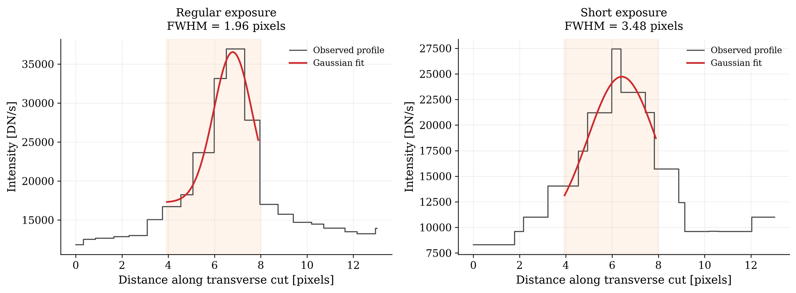

At the start of the week, I picked 4 candidate loops that seemed clear and separated from other loops to analyse widths individually.

I wrote code that asks the user to click on two points to form a perpendicular line across the loop and then plot the intensity profiles of the loop for both the regular- and short-exposure frames.

The code then fits a Gaussian and a constant background to the selected seciton of the transverse intensity profile. It uses the observed peak to make initial estimates for the loop brightness (A), centre (x0), width (sigma) and background (B). cuve_fit then adjusts these four parameters to find the Gaussian curve that best matches the measured intensity values. The fitted sigma is then converted into the loop's FWHM, which gives the measured loop width in pixels. 

I noticed that some of the Gaussian fits were giving really large widths, which I noted and will keep in mind when picking loop candidates in the future as this was due to the loops not being very bright in comparison to the surrounding pixels.

Another issue I had was that some intensity plots had peaks that seemed to be smaller than 1 pixel. This is to do with interpolation and so I decided to change my code to a SunPy example on extracting the intensity of a map along a line.

The automated code that I had finished up on the previous week was loading the interactive image really slowly. This was because all 840 short-exposure files were loaded to find the closest one to the regular image that was being analysed. After updating the code, it just reads the timestamps from the filenames first and then finds the closest timestamps, loading only the short-exposure file that is wanted.

I made some last changes to the code so that the slice is made up of dicontinuous lines, as well as defining the boundaries of each peak to ensure a better fitting.

This week was an introduction to the work I'm going to be doing in measuring the loop widths. I was not expecting to get good results but just to figure out good ways in which to take the measurements in the coming week and also to get comfortable with choosing the settings/loops that give me the best intensity profiles to fit. 

